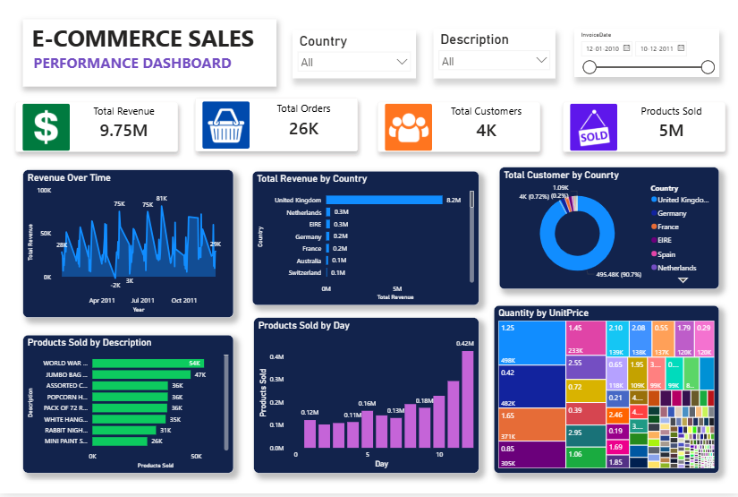

# FUTURE_DS_01: E-Commerce Sales Performance Dashboard

## 📌 Future Interns – Data Science & Analytics Internship

### 🔹 Internship Task Information

| Details | Information |
|----------|-------------|
| Internship Track | Data Science & Analytics |
| Task Number | Task 1 |
| Task Name | Business Sales Performance Analytics |
| Repository Name | FUTURE_DS_01 |
| Developed By | Purvi Jain |
| CIN ID | FIT/APR26/DS16984 |

---

# 🧾 Project Description

This project focuses on analyzing e-commerce business sales data using Power BI to uncover meaningful business insights and performance trends. The dashboard provides a complete overview of sales performance through interactive visualizations, KPI metrics, and regional analysis.

The primary objective of this project is to help businesses make data-driven decisions by identifying:

- Revenue trends
- Customer purchasing behavior
- Top-selling products
- High-performing regions
- Sales patterns and opportunities

The dashboard transforms raw sales data into a visually appealing and easy-to-understand analytical report.

---

# 🎯 Project Objectives

The main objectives of this project are:

✅ Analyze overall sales performance  
✅ Identify top revenue-generating countries  
✅ Discover best-selling products and categories  
✅ Track customer distribution and purchasing trends  
✅ Generate actionable business insights  
✅ Create a professional and client-ready dashboard  

---

# 🛠️ Tools & Technologies Used

| Tool / Technology | Purpose |
|------------------|----------|
| Power BI | Dashboard Design & Visualization |
| Microsoft Excel | Data Storage & Handling |
| Power Query | Data Cleaning & Transformation |
| DAX | KPI Measures & Calculations |

---

# 📂 Repository Structure

```bash
FUTURE_DS_01/
│
├── dashboard/
│   ├── task - 1.pbix
│   └── dashboard.png
│
├── dataset/
│   └── data.csv
│
├── reports/
│   └── Task_Report.pdf
│
├── insights/
│   └── key_insights.md
│
└── README.md
```

---

# 📷 Dashboard Preview

## 🖥️ E-Commerce Sales Performance Dashboard



---


# 📈 Dashboard KPIs

The dashboard contains the following Key Performance Indicators (KPIs):

| KPI | Value |
|------|------|
| 💰 Total Revenue | 9.75M |
| 🛒 Total Orders | 26K |
| 👥 Total Customers | 4K |
| 📦 Products Sold | 5M |

These KPIs help monitor the overall business performance effectively.

---

# 📊 Dashboard Features

The dashboard contains multiple visualizations for deep business analysis.

## 🔹 Revenue Over Time
Shows sales fluctuations and revenue trends across different periods.

### Insights:
- Revenue changes significantly over time.
- Seasonal peaks indicate high customer purchasing activity.

---

## 🔹 Total Revenue by Country
Displays country-wise revenue contribution.

### Insights:
- United Kingdom generated the highest revenue.
- Germany and France are secondary high-performing regions.

---

## 🔹 Total Customers by Country
Shows customer distribution across regions.

### Insights:
- Most customers belong to the UK region.
- Business has a concentrated customer base in Europe.

---

## 🔹 Products Sold by Description
Displays top-selling products based on quantity sold.

### Insights:
- WORLD WAR items and JUMBO BAG products had highest sales.
- Certain categories dominate total sales volume.

---

## 🔹 Products Sold by Day
Analyzes daily sales distribution.

### Insights:
- Sales increased gradually during later days.
- Peak sales were observed at the end of the period.

---

## 🔹 Quantity by Unit Price (Treemap)
Visualizes relationship between quantity sold and product pricing.

### Insights:
- Mid-range priced products generated high sales quantity.
- Affordable products contributed significantly to business revenue.

---


# 💡 Business Recommendations

Based on dashboard analysis, the following recommendations are suggested:

## ✅ Inventory Optimization
Maintain sufficient stock for high-performing products.

## ✅ Regional Marketing
Focus marketing campaigns on top-performing countries.

## ✅ Seasonal Campaigns
Introduce discounts and promotions during high-demand periods.

## ✅ Customer Retention
Develop loyalty programs for repeat customers.

## ✅ Product Expansion
Launch similar products based on top-selling categories.

---

# 🧹 Data Cleaning & Transformation

Before creating visualizations, the dataset was cleaned and transformed using Power Query.

### Cleaning Steps Performed:

- Removed duplicate records
- Handled missing/null values
- Converted invoice dates into proper format
- Filtered invalid transactions
- Standardized product descriptions
- Created calculated measures using DAX

---

# 📚 Skills Gained

This project helped develop the following skills:

✅ Business Analytics  
✅ KPI Analysis  
✅ Dashboard Development  
✅ Data Cleaning  
✅ Power BI Visualization  
✅ Insight Generation  
✅ Data Transformation  
✅ Business Reporting  

---

# 🚀 Project Outcome

Successfully developed a professional interactive dashboard capable of:

✔ Monitoring sales performance  
✔ Analyzing customer behavior  
✔ Identifying high-performing products  
✔ Generating business recommendations  
✔ Supporting data-driven decision-making  

The dashboard can be used by businesses for strategic planning and performance monitoring.

---

# ⚠️ Challenges Faced

During the project, several challenges were encountered:

- Handling inconsistent data
- Managing large datasets
- Choosing effective visualizations
- Creating a visually balanced dashboard
- Designing interactive filters

These challenges improved practical problem-solving and analytical skills.

---

# 📌 Future Improvements

Possible future enhancements include:

- Predictive sales forecasting
- Customer segmentation analysis
- AI-based recommendation systems
- Real-time dashboard integration
- Advanced business intelligence reporting

---

# 👩‍💻 Author

## Purvi Jain

🎓 B.Tech Artificial Intelligence  
🏫 Delhi Skill and Entrepreneurship University (DSEU)

---

# ⭐ Acknowledgement

This project was completed as part of the **Future Interns – Data Science & Analytics Internship Program**.

Special thanks to Future Interns for providing practical industry-oriented learning opportunities.

---
